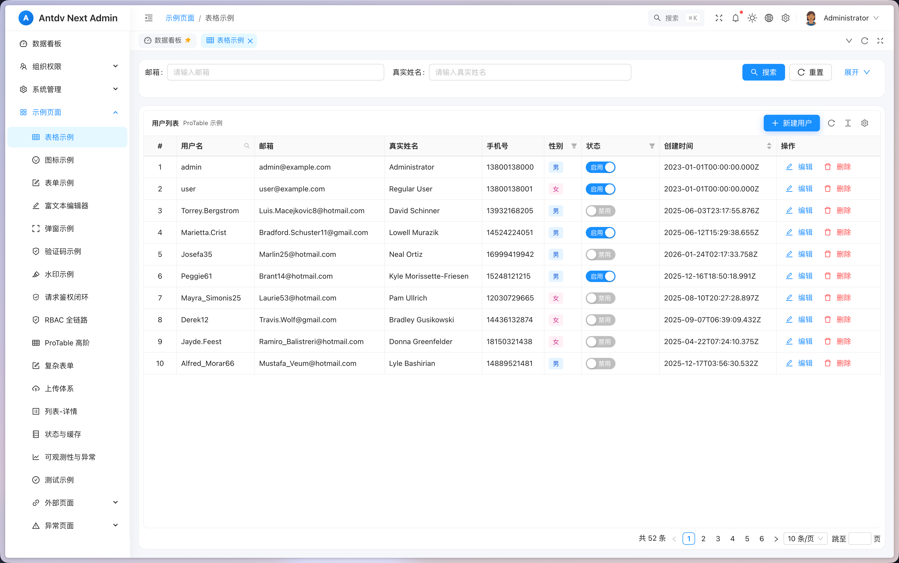

# Antdv Next Admin

🎉 一个基于 Vue 3 + TypeScript + Ant Design Vue 的现代化、功能完整的后台管理系统脚手架。

[](https://vuejs.org/)
[](https://www.typescriptlang.org/)
[](https://vitejs.dev/)
[](LICENSE)

## 📸 预览

**在线体验:** [https://antdv-next-admin.yelog.org/dashboard](https://antdv-next-admin.yelog.org/dashboard)



> 默认账号: admin / 123456 或 user / 123456

## ✨ 特性

### 核心功能
- ✅ **最新技术栈**: Vue 3 + Vite + TypeScript + Pinia
- ✅ **UI 组件**: Ant Design Vue (antdv-next)
- ✅ **布局系统**: 响应式布局，支持垂直/水平两种模式
- ✅ **多标签页**: 基于 KeepAlive 的多标签页系统，支持固定、刷新、右键菜单
- ✅ **主题系统**: 支持亮色/暗色/跟随系统三种模式
- ✅ **国际化**: 完整的中英文切换，支持运行时动态切换
- ✅ **权限系统**: RBAC 权限控制，支持动态路由、按钮级权限、指令权限
- ✅ **Mock 数据**: 开发环境完整的 Mock 数据支持

### 高级功能
- 🎨 **偏好设置**:
  - 6 种预设主题色 (拂晓蓝、极光绿、酱紫、薄暮红、日暮橙、明青)
  - 左侧菜单栏样式切换 (深色/浅色)
  - 布局方式切换 (垂直/水平)
  - 5种页面切换动画 (淡入、滑动、缩放等)
  - 灰色模式/色弱模式

- 🎯 **精致设计**:
  - 流畅的动画效果
  - 细腻的交互反馈
  - 响应式设计
  - 一致的设计语言

### Pro 组件
- 📊 **ProTable**: 高级表格组件
  - 自动生成查询表单
  - 列配置化（显示/隐藏、排序、固定）
  - 内置分页、刷新、密度切换
  - 支持多种值类型渲染（日期、标签、进度条等）
  
- 📝 **ProForm**: 高级表单组件
  - 配置化表单生成
  - 自动布局和验证
  - 支持多种表单类型
  - 内置提交/重置逻辑

- 🎭 **ProModal**: 高级弹窗组件
  - 支持拖拽、全屏
  - 自动表单集成
  - 统一的确认/取消逻辑

### 业务组件
- 📝 **富文本编辑器**: 基于 TipTap，支持图片、链接、格式化
- 🔐 **验证码组件**: 
  - 滑块验证码
  - 拼图验证码
  - 点选验证码
  - 旋转验证码
- 🎨 **图标选择器**: 支持 Iconify 图标库搜索选择
- 💧 **水印组件**: 支持文字/图片水印，可配置透明度、角度

## 🚀 快速开始

### 安装依赖

```bash
npm install
```

### 启动开发服务器

```bash
npm run dev
```

访问 `http://localhost:3000`

### 默认账号

```bash
管理员账号:
用户名: admin
密码: 123456

普通用户账号:
用户名: user
密码: 123456
```

### 构建生产版本

```bash
npm run build
```

### 预览生产构建

```bash
npm run preview
```

## 📁 项目结构

```
antdv-next-admin/
├── public/                     # 静态资源
│   └── logo.svg               # 应用Logo
├── src/
│   ├── api/                   # API接口
│   │   ├── auth.ts           # 认证接口
│   │   ├── user.ts           # 用户管理
│   │   ├── role.ts           # 角色管理
│   │   ├── permission.ts     # 权限管理
│   │   ├── dept.ts           # 部门管理
│   │   ├── dict.ts           # 字典管理
│   │   ├── config.ts         # 系统配置
│   │   ├── file.ts           # 文件管理
│   │   └── log.ts            # 日志管理
│   ├── assets/                # 资源文件
│   │   └── styles/            # 全局样式
│   │       ├── global.css     # 全局样式
│   │       ├── variables.css  # CSS变量
│   │       └── animations.css # 动画定义
│   ├── components/            # 组件
│   │   ├── Layout/            # 布局组件
│   │   │   ├── AdminLayout.vue
│   │   │   ├── Sidebar.vue
│   │   │   ├── Header.vue
│   │   │   ├── TabBar.vue
│   │   │   ├── MenuItem.vue
│   │   │   ├── Breadcrumb.vue
│   │   │   ├── ThemeToggle.vue
│   │   │   ├── LanguageSwitch.vue
│   │   │   ├── FullscreenToggle.vue
│   │   │   ├── NotificationPanel.vue
│   │   │   ├── AvatarDropdown.vue
│   │   │   ├── GlobalSearch.vue
│   │   │   └── SettingsDrawer.vue
│   │   ├── Pro/               # Pro 高级组件
│   │   │   ├── ProTable/      # 高级表格
│   │   │   ├── ProForm/       # 高级表单
│   │   │   └── ProModal/      # 高级弹窗
│   │   ├── Permission/        # 权限组件
│   │   │   └── PermissionButton.vue
│   │   ├── Editor/            # 富文本编辑器
│   │   ├── Captcha/           # 验证码组件
│   │   │   ├── SliderCaptcha.vue    # 滑块验证码
│   │   │   ├── PuzzleCaptcha.vue    # 拼图验证码
│   │   │   ├── PointCaptcha.vue     # 点选验证码
│   │   │   └── RotateCaptcha.vue    # 旋转验证码
│   │   ├── IconPicker/        # 图标选择器
│   │   └── Icon/              # 图标组件
│   ├── composables/           # 组合式函数
│   │   ├── usePermission.ts  # 权限判断
│   │   ├── useWatermark.ts   # 水印功能
│   │   └── useFullscreen.ts  # 全屏切换
│   ├── directives/            # 自定义指令
│   │   ├── index.ts
│   │   └── permission.ts      # 权限指令
│   ├── locales/              # 国际化
│   │   ├── index.ts
│   │   ├── zh-CN.ts          # 中文
│   │   └── en-US.ts          # 英文
│   ├── router/               # 路由
│   │   ├── index.ts
│   │   ├── routes.ts         # 路由配置
│   │   ├── guards.ts         # 路由守卫
│   │   └── utils.ts          # 路由工具
│   ├── stores/               # Pinia状态管理
│   │   ├── index.ts
│   │   ├── auth.ts           # 认证状态
│   │   ├── layout.ts         # 布局状态
│   │   ├── theme.ts          # 主题状态
│   │   ├── tabs.ts           # 标签页状态
│   │   ├── permission.ts     # 权限状态
│   │   ├── notification.ts   # 通知状态
│   │   ├── settings.ts       # 偏好设置
│   │   ├── dict.ts           # 字典数据
│   │   ├── watermark.ts      # 水印状态
│   │   └── demoStateCache.ts # 演示缓存
│   ├── types/                # TypeScript类型
│   │   ├── api.ts
│   │   ├── auth.ts
│   │   ├── router.ts
│   │   ├── layout.ts
│   │   └── pro.ts
│   ├── utils/                # 工具函数
│   │   ├── request.ts        # Axios封装
│   │   ├── storage.ts        # Storage封装
│   │   ├── auth.ts           # 认证工具
│   │   ├── helpers.ts        # 辅助函数
│   │   ├── i18n.ts           # 国际化工具
│   │   └── icon.ts           # 图标工具
│   ├── views/                # 页面
│   │   ├── login/            # 登录页
│   │   ├── dashboard/        # 数据看板
│   │   ├── profile/          # 个人中心
│   │   ├── notification/     # 通知中心
│   │   ├── system/           # 系统管理
│   │   │   ├── user/         # 用户管理
│   │   │   ├── role/         # 角色管理
│   │   │   ├── permission/   # 权限管理
│   │   │   ├── dept/         # 部门管理
│   │   │   ├── dict/         # 字典管理
│   │   │   ├── config/       # 系统配置
│   │   │   ├── file/         # 文件管理
│   │   │   └── log/          # 日志管理
│   │   ├── examples/         # 示例页面
│   │   │   ├── table/        # 表格示例
│   │   │   ├── form/         # 表单示例
│   │   │   ├── editor/       # 编辑器示例
│   │   │   ├── icon/         # 图标示例
│   │   │   ├── modal/        # 弹窗示例
│   │   │   ├── captcha/      # 验证码示例
│   │   │   ├── watermark/    # 水印示例
│   │   │   ├── external/     # 外部链接示例
│   │   │   └── scaffold/     # 脚手架示例
│   │   │       ├── rbac/              # RBAC权限示例
│   │   │       ├── state-cache/       # 状态缓存示例
│   │   │       ├── upload-system/     # 文件上传示例
│   │   │       ├── pro-table-advanced/# 高级表格示例
│   │   │       ├── observability/     # 可观测性示例
│   │   │       ├── testing/           # 测试示例
│   │   │       ├── complex-form/      # 复杂表单示例
│   │   │       ├── request-auth/      # 请求鉴权示例
│   │   │       └── master-detail/     # 主从表示例
│   │   └── error/            # 错误页面
│   │       ├── 404.vue
│   │       ├── 403.vue
│   │       └── 500.vue
│   ├── App.vue
│   └── main.ts
├── mock/                     # Mock数据
│   ├── data/                 # Mock数据源
│   │   ├── users.data.ts
│   │   ├── roles.data.ts
│   │   ├── permissions.data.ts
│   │   └── dashboard.data.ts
│   └── handlers/             # Mock处理器
│       ├── auth.mock.ts
│       ├── user.mock.ts
│       ├── role.mock.ts
│       ├── permission.mock.ts
│       └── dashboard.mock.ts
├── docs/                     # 文档资源
│   └── images/              # 图片资源
├── .env                      # 环境变量
├── .env.development          # 开发环境
├── .env.production           # 生产环境
├── .gitignore
├── index.html
├── package.json
├── tsconfig.json
├── vite.config.ts
└── README.md
```

## 🎯 项目状态

### ✅ 已完成功能 (13/15 - 87%)

**核心架构:**
- ✅ 项目初始化和配置
- ✅ 完整的设计系统（6种主题色、动画、工具类）
- ✅ TypeScript类型定义体系
- ✅ 7个Pinia状态管理Store
- ✅ 路由系统（静态+动态路由、路由守卫）
- ✅ 权限系统（指令、组合函数、组件）
- ✅ 国际化（中英文完整翻译）
- ✅ Mock数据系统（完整的CRUD API）
- ✅ 工具函数库（30+实用函数）
- ✅ 组合式函数（usePermission、useWatermark、useFullscreen等）

**布局组件:**
- ✅ AdminLayout（主布局，支持垂直/水平模式）
- ✅ Sidebar（侧边栏，支持深色/浅色主题）
- ✅ Header（顶部导航栏）
- ✅ TabBar（多标签页系统，右键菜单）
- ✅ MenuItem（递归菜单组件）
- ✅ Breadcrumb（面包屑导航）
- ✅ ThemeToggle（主题切换）
- ✅ LanguageSwitch（语言切换）
- ✅ FullscreenToggle（全屏切换）
- ✅ NotificationPanel（通知面板）
- ✅ AvatarDropdown（用户下拉菜单）
- ✅ GlobalSearch（全局搜索）
- ✅ SettingsDrawer（偏好设置抽屉）

**页面视图:**
- ✅ 登录页（完整的登录表单和验证）
- ✅ Dashboard（统计卡片、图表、活动列表）
- ✅ 个人中心（用户信息、账号设置）
- ✅ 通知中心（系统通知、消息管理）
- ✅ 系统管理模块
  - 用户管理（CRUD、搜索、分页）
  - 角色管理（权限分配、菜单权限）
  - 权限管理（权限树、增删改查）
  - 部门管理（树形结构、组织架构）
  - 字典管理（数据字典、键值对）
  - 系统配置（参数配置、系统设置）
  - 文件管理（上传、下载、预览）
  - 日志管理（操作日志、登录日志）
- ✅ 示例页面（丰富的示例代码）
  - 表格示例（ProTable 高级表格）
  - 表单示例（ProForm 高级表单）
  - 富文本编辑器（TipTap 集成）
  - 图标示例（Iconify 图标库）
  - 弹窗示例（ProModal 高级弹窗）
  - 验证码示例（4种验证码类型）
  - 水印示例（文字/图片水印）
  - 外部链接（iframe/新窗口打开）
- ✅ 脚手架示例（最佳实践模板）
  - RBAC 权限示例
  - 状态缓存示例
  - 文件上传示例
  - 高级表格示例
  - 可观测性示例
  - 测试示例
  - 复杂表单示例
  - 请求鉴权示例
  - 主从表示例
- ✅ 错误页面（404、403、500）

## 🎨 技术栈

### 核心框架
- **Vue 3.4+** - 渐进式 JavaScript 框架
- **TypeScript 5+** - JavaScript 的超集
- **Vite 5+** - 下一代前端构建工具

### UI & 样式
- **Ant Design Vue** - 企业级 UI 组件库
- **CSS Variables** - 现代化的主题系统
- **SCSS** - CSS 预处理器

### 状态管理 & 路由
- **Pinia 2+** - Vue 官方状态管理
- **Vue Router 4+** - Vue 官方路由

### 工具库
- **vue-i18n** - 国际化
- **Axios** - HTTP 客户端
- **dayjs** - 日期处理
- **lodash-es** - 工具函数库
- **@faker-js/faker** - 假数据生成

### 开发工具
- **vite-plugin-mock-dev-server** - Mock 服务
- **ESLint** - 代码检查
- **Prettier** - 代码格式化

## 🔧 开发指南

### 环境要求

- Node.js >= 16
- npm >= 8

### 环境变量

**开发环境 (.env.development):**
```bash
VITE_USE_MOCK=true
VITE_API_BASE_URL=/api
```

**生产环境 (.env.production):**
```bash
VITE_USE_MOCK=false
VITE_API_BASE_URL=https://your-api-domain.com/api
```

### 代码规范

- 使用 TypeScript 进行类型安全的开发
- 遵循 Vue 3 Composition API 最佳实践
- 组件命名使用 PascalCase
- 文件命名使用 kebab-case
- 使用 CSS Variables 进行主题定制

### 权限使用

**指令方式:**
```vue
<a-button v-permission="'user.create'">创建用户</a-button>
<a-button v-permission="['user.edit', 'user.delete']">操作</a-button>
<a-button v-permission.all="['user.edit', 'user.approve']">审批</a-button>
```

**组合函数方式:**
```ts
const { can, canAll } = usePermission()

if (can('user.create')) {
  // 有创建权限
}

if (canAll(['user.edit', 'user.approve'])) {
  // 同时有编辑和审批权限
}
```

**组件方式:**
```vue
<PermissionButton permission="user.create">
  <a-button>创建用户</a-button>
</PermissionButton>
```

## 📝 Mock 数据

项目集成了完整的 Mock 数据系统，开发环境下自动启用。

### 可用的 Mock API

- **认证接口**
  - POST `/api/auth/login` - 登录
  - POST `/api/auth/logout` - 登出
  - GET `/api/auth/info` - 获取用户信息

- **用户管理**
  - GET `/api/users` - 用户列表（支持分页、搜索）
  - GET `/api/users/:id` - 获取用户详情
  - POST `/api/users` - 创建用户
  - PUT `/api/users/:id` - 更新用户
  - DELETE `/api/users/:id` - 删除用户

- **角色管理**
  - GET `/api/roles` - 角色列表
  - GET `/api/roles/:id` - 获取角色详情
  - POST `/api/roles` - 创建角色
  - PUT `/api/roles/:id` - 更新角色
  - DELETE `/api/roles/:id` - 删除角色

- **权限管理**
  - GET `/api/permissions` - 权限列表
  - GET `/api/permissions/tree` - 权限树

- **部门管理**
  - GET `/api/depts` - 部门列表
  - GET `/api/depts/tree` - 部门树形结构

- **字典管理**
  - GET `/api/dict/types` - 字典类型列表
  - GET `/api/dict/data/:type` - 字典数据

- **系统配置**
  - GET `/api/config` - 配置列表
  - PUT `/api/config/:key` - 更新配置

- **文件管理**
  - POST `/api/files/upload` - 上传文件
  - GET `/api/files` - 文件列表

- **日志管理**
  - GET `/api/logs` - 日志列表

- **Dashboard**
  - GET `/api/dashboard/stats` - 统计数据
  - GET `/api/dashboard/chart-data` - 图表数据

## 🎯 特色功能

### 1. 多主题支持

6种预设主题色 + 深色/浅色模式 + 跟随系统，共18种主题组合。

### 2. 灵活布局

- 垂直布局（侧边栏在左）
- 水平布局（菜单在顶部）
- 响应式适配移动端

### 3. 多标签页系统

- 支持标签页缓存（KeepAlive）
- 支持固定标签（affix/pinned）
- 右键菜单（刷新、固定、关闭、关闭其他、关闭左侧、关闭右侧、关闭所有）
- 标签页持久化存储

### 4. 全局搜索

快捷键 `Ctrl/Cmd + K` 唤起全局菜单搜索。

### 5. 国际化

完整的中英文翻译，支持运行时切换，所有组件均已国际化。

### 6. Pro 组件使用

#### ProTable 示例

```vue
<template>
  <ProTable
    :columns="columns"
    :request="loadData"
    :search="searchConfig"
  >
    <template #toolbar>
      <a-button type="primary">新建</a-button>
    </template>
  </ProTable>
</template>

<script setup lang="ts">
import { ProTable } from '@/components/Pro'

const columns = [
  { title: '姓名', dataIndex: 'name', valueType: 'text' },
  { title: '年龄', dataIndex: 'age', valueType: 'number' },
  { title: '状态', dataIndex: 'status', valueType: 'tag' },
  { title: '创建时间', dataIndex: 'createdAt', valueType: 'date' }
]

const loadData = async (params: any) => {
  // 返回 { data: [], total: 0 }
}
</script>
```

#### ProForm 示例

```vue
<template>
  <ProForm
    :schema="formSchema"
    :initial-values="initialValues"
    @submit="handleSubmit"
  />
</template>

<script setup lang="ts">
import { ProForm } from '@/components/Pro'

const formSchema = [
  { label: '用户名', name: 'username', type: 'input', required: true },
  { label: '邮箱', name: 'email', type: 'input', rules: [{ type: 'email' }] },
  { label: '角色', name: 'role', type: 'select', options: roleOptions },
  { label: '状态', name: 'status', type: 'switch' }
]

const handleSubmit = (values: any) => {
  console.log('提交表单:', values)
}
</script>
```

### 7. 验证码组件

```vue
<template>
  <!-- 滑块验证码 -->
  <SliderCaptcha @success="handleSuccess" />
  
  <!-- 拼图验证码 -->
  <PuzzleCaptcha @success="handleSuccess" />
  
  <!-- 点选验证码 -->
  <PointCaptcha @success="handleSuccess" />
  
  <!-- 旋转验证码 -->
  <RotateCaptcha @success="handleSuccess" />
</template>
```

### 8. 富文本编辑器

基于 TipTap 的富文本编辑器，支持：
- 文本格式化（粗体、斜体、下划线）
- 标题、列表、引用
- 图片上传和插入
- 链接插入
- 代码块
- 历史记录（撤销/重做）

## 🤝 贡献

欢迎提交 Issue 和 Pull Request！

## 📄 许可

MIT License

## 🙏 致谢

- [Vue 3](https://vuejs.org/)
- [Vite](https://vitejs.dev/)
- [Ant Design Vue](https://antdv.com/)
- [vue-vben-admin](https://github.com/vbenjs/vue-vben-admin)
- [Ant Design Pro Vue](https://pro.antdv.com/)

---

Made with ❤️ by Claude Code
