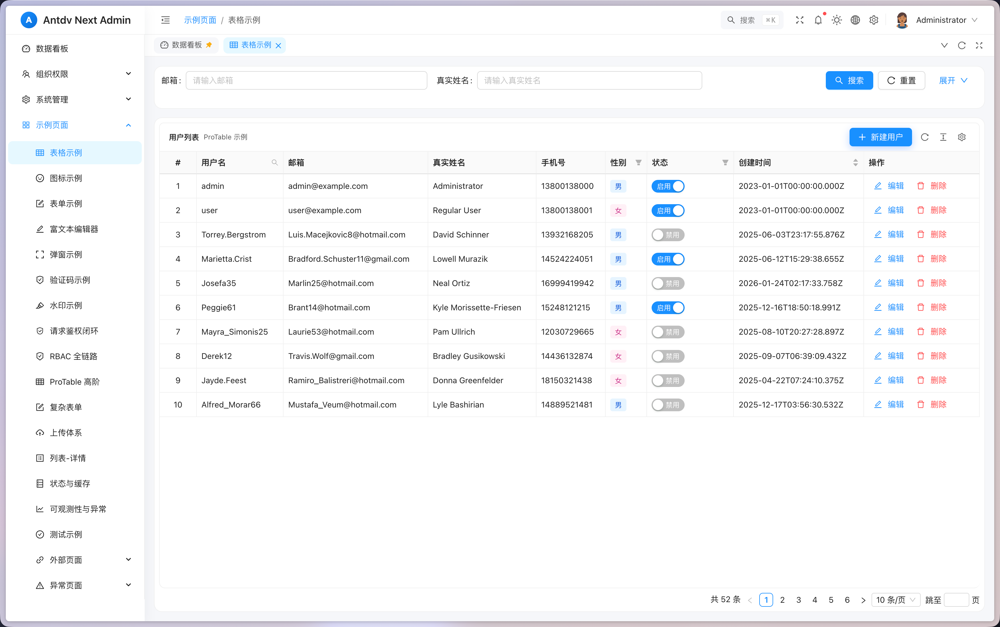

# Antdv Next Admin

[](https://github.com/yelog/antdv-next-admin/actions/workflows/ci-cd.yml)
[](LICENSE)
[](https://nodejs.org/)
[](https://vuejs.org/)
[](https://www.typescriptlang.org/)
[](https://vitejs.dev/)
[](CONTRIBUTING.md)

[English](README.md) | **简体中文** | [日本語](README.ja-JP.md) | [한국어](README.ko-KR.md)

一个基于 Vue 3 + TypeScript + Ant Design Vue 的现代化、功能完整的后台管理系统脚手架。

## 预览

**在线体验:** [https://antdv-next-admin.yelog.org/dashboard](https://antdv-next-admin.yelog.org/dashboard)



> 默认账号: admin / 123456 或 user / 123456

## 特性

### 核心功能
- 最新技术栈: Vue 3 + Vite + TypeScript + Pinia
- UI 组件: Ant Design Vue (antdv-next)
- 布局系统: 响应式布局，支持垂直/水平两种模式
- 多标签页: 基于 KeepAlive 的多标签页系统，支持固定、刷新、右键菜单
- 主题系统: 支持亮色/暗色/跟随系统三种模式
- 国际化: 完整的中英文切换，支持运行时动态切换
- 权限系统: RBAC 权限控制，支持动态路由、按钮级权限、指令权限
- Mock 数据: 开发环境完整的 Mock 数据支持

### 高级功能
- 偏好设置:
  - 6 种预设主题色 (拂晓蓝、极光绿、酱紫、薄暮红、日暮橙、明青)
  - 左侧菜单栏样式切换 (深色/浅色)
  - 布局方式切换 (垂直/水平)
  - 5种页面切换动画 (淡入、滑动、缩放等)
  - 灰色模式/色弱模式

- 精致设计:
  - 流畅的动画效果
  - 细腻的交互反馈
  - 响应式设计
  - 一致的设计语言

### Pro 组件
- ProTable: 高级表格组件
  - 自动生成查询表单
  - 列配置化（显示/隐藏、排序、固定）
  - 内置分页、刷新、密度切换
  - 支持多种值类型渲染（日期、标签、进度条等）

- ProForm: 高级表单组件
  - 配置化表单生成
  - 自动布局和验证
  - 支持多种表单类型
  - 内置提交/重置逻辑

- ProModal: 高级弹窗组件
  - 支持拖拽、全屏
  - 自动表单集成
  - 统一的确认/取消逻辑

### 业务组件
- 富文本编辑器: 基于 TipTap，支持图片、链接、格式化
- 验证码组件: 滑块验证码、拼图验证码、点选验证码、旋转验证码
- 图标选择器: 支持 Iconify 图标库搜索选择
- 水印组件: 支持文字/图片水印，可配置透明度、角度

## 快速开始

### 安装依赖

```bash
npm install
# 或
pnpm install
```

### 启动开发服务器

```bash
npm run dev
```

访问 `http://localhost:3000`

### 默认账号

```
管理员账号:
用户名: admin
密码: 123456

普通用户账号:
用户名: user
密码: 123456
```

### 构建生产版本

```bash
npm run build
```

### 预览生产构建

```bash
npm run preview
```

## 项目结构

```
antdv-next-admin/
├── public/                     # 静态资源
├── src/
│   ├── api/                    # API 接口
│   ├── assets/                 # 资源文件
│   │   └── styles/             # 全局样式
│   ├── components/             # 组件
│   │   ├── Layout/             # 布局组件
│   │   ├── Pro/                # Pro 高级组件
│   │   ├── Permission/         # 权限组件
│   │   ├── Editor/             # 富文本编辑器
│   │   ├── Captcha/            # 验证码组件
│   │   └── IconPicker/         # 图标选择器
│   ├── composables/            # 组合式函数
│   ├── directives/             # 自定义指令
│   ├── locales/                # 国际化文件
│   ├── router/                 # 路由配置
│   ├── stores/                 # Pinia 状态管理
│   ├── types/                  # TypeScript 类型
│   ├── utils/                  # 工具函数
│   └── views/                  # 页面视图
├── mock/                       # Mock 数据
├── docs/                       # 文档资源
└── ...配置文件
```

## 技术栈

### 核心框架
- Vue 3.4+ - 渐进式 JavaScript 框架
- TypeScript 5+ - JavaScript 的超集
- Vite 5+ - 下一代前端构建工具

### UI & 样式
- Ant Design Vue - 企业级 UI 组件库
- CSS Variables - 现代化的主题系统
- SCSS - CSS 预处理器

### 状态管理 & 路由
- Pinia 2+ - Vue 官方状态管理
- Vue Router 4+ - Vue 官方路由

### 工具库
- vue-i18n - 国际化
- Axios - HTTP 客户端
- dayjs - 日期处理
- lodash-es - 工具函数库

### 开发工具
- vite-plugin-mock-dev-server - Mock 服务
- ESLint - 代码检查
- Prettier - 代码格式化

## 开发指南

### 环境要求

- Node.js >= 18
- npm >= 8 或 pnpm >= 8

### 环境变量

**开发环境 (.env.development):**
```bash
VITE_USE_MOCK=true
VITE_API_BASE_URL=/api
```

**生产环境 (.env.production):**
```bash
VITE_USE_MOCK=false
VITE_API_BASE_URL=https://your-api-domain.com/api
```

### 权限使用

**指令方式:**
```vue
<a-button v-permission="'user.create'">创建用户</a-button>
<a-button v-permission="['user.edit', 'user.delete']">操作</a-button>
<a-button v-permission.all="['user.edit', 'user.approve']">审批</a-button>
```

**组合函数方式:**
```ts
const { can, canAll } = usePermission()

if (can('user.create')) {
  // 有创建权限
}

if (canAll(['user.edit', 'user.approve'])) {
  // 同时有编辑和审批权限
}
```

**组件方式:**
```vue
<PermissionButton permission="user.create">
  <a-button>创建用户</a-button>
</PermissionButton>
```

## Mock 数据

项目集成了完整的 Mock 数据系统，开发环境下自动启用。

### 可用的 Mock API

- **认证接口**: 登录、登出、获取用户信息
- **用户管理**: 列表、创建、更新、删除
- **角色管理**: 完整 CRUD
- **权限管理**: 列表、权限树
- **部门管理**: 列表、树形结构
- **字典管理**: 类型列表、数据查询
- **系统配置**: 配置列表、更新
- **文件管理**: 上传、列表
- **日志管理**: 日志列表
- **Dashboard**: 统计数据、图表数据

## 特色功能

### 多主题支持
6种预设主题色 × 3种模式 (亮色/暗色/跟随系统) = 18种主题组合

### 灵活布局
- 垂直布局（侧边栏在左）
- 水平布局（菜单在顶部）
- 响应式适配移动端

### 多标签页系统
- 标签页缓存 (KeepAlive)
- 固定标签 (affix/pinned)
- 右键菜单（刷新、固定、关闭、关闭其他、关闭左侧/右侧、关闭所有）
- 持久化存储

### 全局搜索
快捷键 `Ctrl/Cmd + K` 唤起全局菜单搜索。

### 国际化
完整的中英文翻译，支持运行时切换。

## 贡献

欢迎提交 Issue 和 Pull Request！详情请阅读 [CONTRIBUTING.md](CONTRIBUTING.md)。

## 许可

MIT License

## 致谢

- [Vue 3](https://vuejs.org/)
- [Vite](https://vitejs.dev/)
- [Ant Design Vue](https://antdv.com/)
- [vue-vben-admin](https://github.com/vbenjs/vue-vben-admin)
- [Ant Design Pro Vue](https://pro.antdv.com/)

---

Made with ❤️ by Claude Code